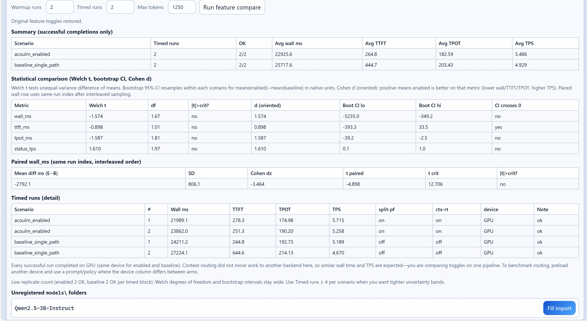

# AcouLM

🌐 **Website:** https://est4ever.github.io/AcouLM/

## What is AcouLM?

AcouLM is a **local AI control plane** for running language models on your own PC — not a cloud chat app.

You run one command (`acoulm`). AcouLM starts three pieces on your machine:

1. **Backend API** (`http://127.0.0.1:8000/v1`) — loads your model and runs inference (built-in OpenVINO runtime, or an external server you register).
2. **Browser control panel** (`http://127.0.0.1:5173`) — chat UI, model/backend registry, device switch (CPU/GPU/NPU), and optional routing features (split-prefill, context-routing).
3. **Terminal chat** — same API from PowerShell for quick prompts without opening the browser.

**Nothing is sent to AcouLM’s servers.** Prompts and weights stay local unless *you* point the API at a remote backend. The repo does not ship model files; you download or point to your own OpenVINO IR or GGUF.

## Demo

**Screenshot** — the control panel after `acoulm` is ready: Workspace chat on the left, runtime chips (device, model, backend, routing flags), and the Control tab for registry and system settings.

<p align="center">
  
</p>

**Video** — end-to-end on Windows: setup, `acoulm` starting the stack, the control panel at `127.0.0.1`, and a local chat reply (no cloud). Plays inline below (with controls).

https://github.com/user-attachments/assets/b8b1e929-edd7-49ae-8435-2d62cc517f63


| Doc | Purpose |
|-----|---------|
| [GETTING_STARTED.md](GETTING_STARTED.md) | Full setup (Windows, Linux, external backends) |
| [SECURITY.md](SECURITY.md) | Localhost bind, API token, SSH tunnels |
| [PUBLISH_CHECKLIST.md](PUBLISH_CHECKLIST.md) | Before sharing the repo publicly |

## Platform support

| Platform | Status |
|----------|--------|
| **Windows 10/11 x64** | **Supported** — primary path (`acoulm`, release zip `acoulm-dist-windows-x64.zip`) |
| **Linux (OpenVINO / SLURM)** | **Under development** — experimental scripts; expect rough edges |
| **Linux + NVIDIA CUDA (GGUF)** | **Under development** — not a polished end-user path yet |

For day-to-day use today, use **Windows**. Linux and CUDA flows are for contributors and custom deployments; the shell and API are the same, only the backend entrypoint changes.

## Windows quick start

Requires [Git for Windows](https://git-scm.com/download/win) and a [GitHub Release](https://github.com/est4ever/AcouLM/releases) asset **`acoulm-dist-windows-x64.zip`** (or build from source — see [GETTING_STARTED.md](GETTING_STARTED.md)).

```powershell
powershell -NoProfile -ExecutionPolicy Bypass -Command "& ([scriptblock]::Create((irm 'https://raw.githubusercontent.com/est4ever/AcouLM/main/install.ps1' -UseBasicParsing)))"
cd $env:USERPROFILE\AcouLM
.\portable_setup.ps1
acoulm setup
acoulm
```

- Control panel: http://127.0.0.1:5173  
- API: http://127.0.0.1:8000/v1  

Shell-only (Ollama, llama.cpp, custom backend): `install.ps1 -ShellOnly` — details in [GETTING_STARTED.md — external backend](GETTING_STARTED.md#windows--external-backend).

## Daily commands

| Task | Command |
|------|---------|
| UI + API + chat | `acoulm` |
| One-time PATH / home | `acoulm setup` |
| CPU-only (16 GB RAM / weak iGPU) | `acoulm cpu` |
| Stop stack | `acoulm stop` |
| Help | `acoulm help` |

Model weights are **not** in this repo. Built-in backend wants **OpenVINO IR** or a **single supported `.gguf`**; raw Hugging Face `.safetensors` must be exported first (setup can help). See [GETTING_STARTED.md](GETTING_STARTED.md) and [Model formats](GETTING_STARTED.md#before-you-run-anything).

## Backends at a glance

| Backend | Role |
|---------|------|
| **Built-in** (`npu_wrapper`, OpenVINO GenAI) | Shipped in release zip or `build.ps1` — CPU / GPU / NPU when OpenVINO finds devices |
| **External** (`registry/backends_registry.json`) | Your server (Ollama, llama.cpp CUDA, custom) — any hardware the server supports |

## More documentation

- [ARCHITECTURE.md](ARCHITECTURE.md) — components and routing
- [API_CONTRACT_V1.md](API_CONTRACT_V1.md) — HTTP API
- [CLI_USAGE.md](CLI_USAGE.md) — CLI reference
- [PUBLISH_GUIDE.md](PUBLISH_GUIDE.md) — releases and distribution

## License

MIT — see [LICENSE](LICENSE).
